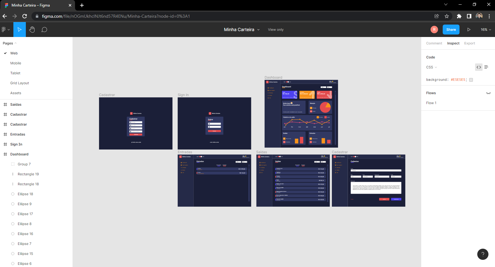

<h1 align="center">
  
   
  Dashboard React TypeScript 
</h1>

<h3 align="justify">
Application with dashboard developed react with typescript.
</h3>
 

## 📷 Demonstration

<h4 align="left"></h4>
  

 

## 🚀 Technologies

This project was developed with the following technologies:

- [TypeScript](https://www.typescriptlang.org/docs/)
- [ReactJS](https://reactjs.org/)
- [StyledComponents](https://styled-components.com)
- [GoogleFonts](https://fonts.google.com)
- [Coolors.co](https://coolors.co)
- [Emoji](https://www.w3schools.com/charsets/ref_emoji_smileys.asp)
- [React-Switch](https://www.npmjs.com/package/react-switch)
- [React-Icons](https://github.com/react-icons/react-icons)
- [React-Router-Dom](https:/npmjs.com/package/react-router-dom)
- [uuidv4](https://yarnpkg.com/package/uuidv4)
- [React-Countup](https://npmjs.com/package/react-countup)
- [FlatIcon](https://www.flaticon.com/br/icones)
- [Recharts](https://recharts.org/en-US/)

 

## ⚙ Commands Running
- yarn
- yarn start

Made with 💜 by Rafael Maciel
